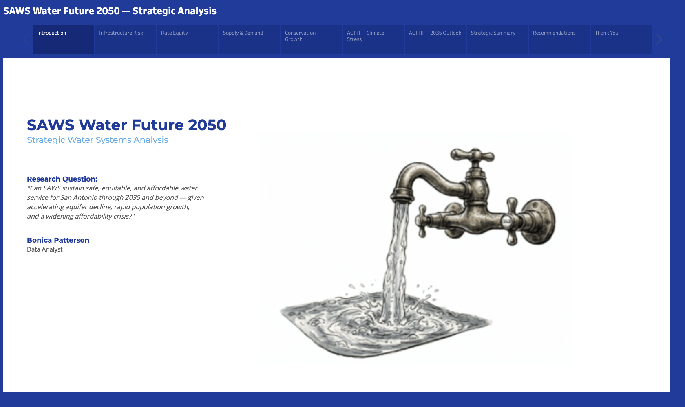
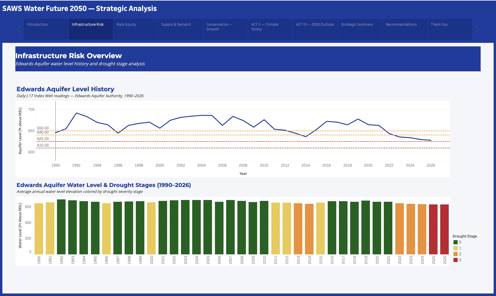
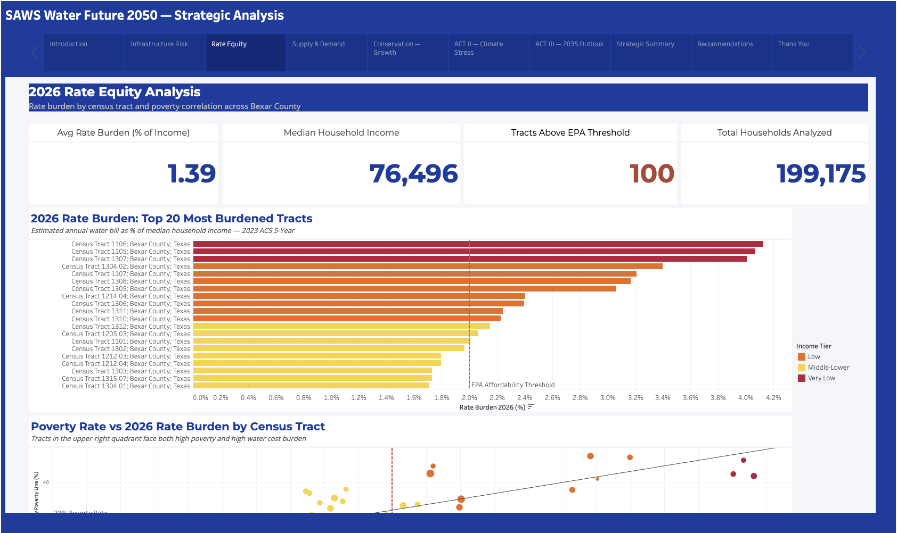
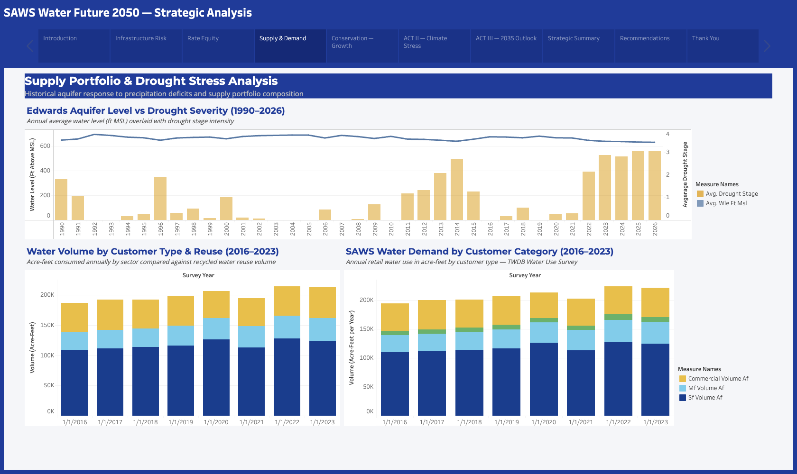
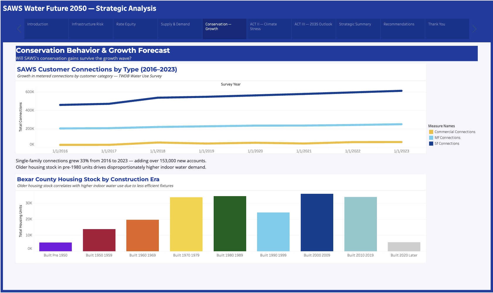
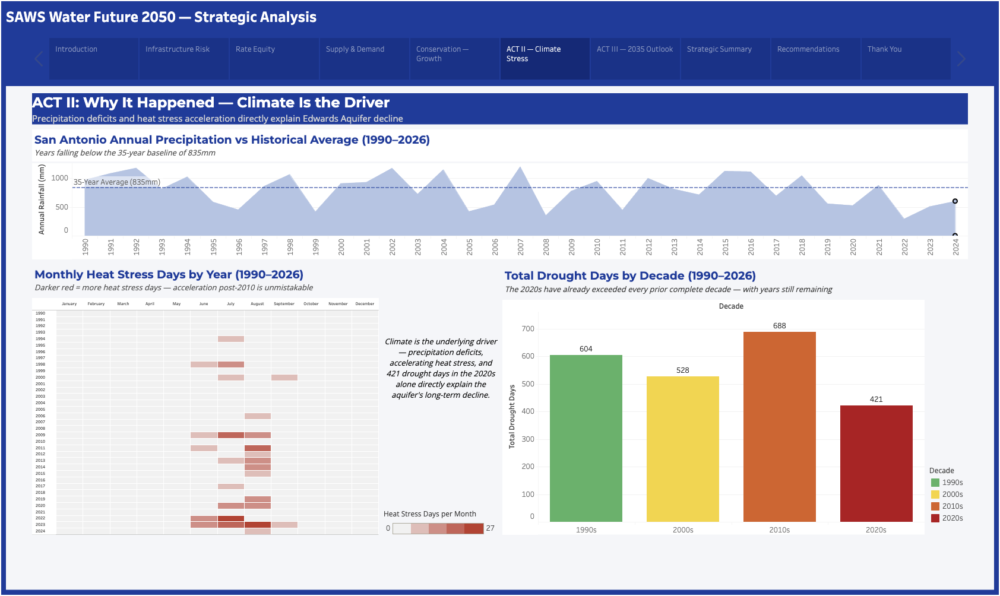
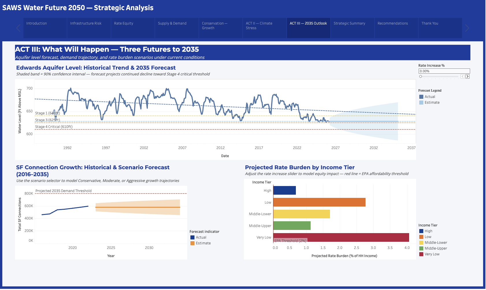
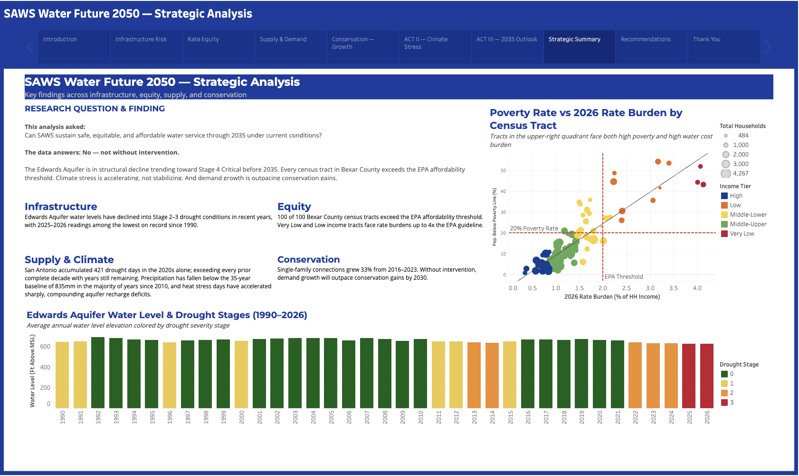
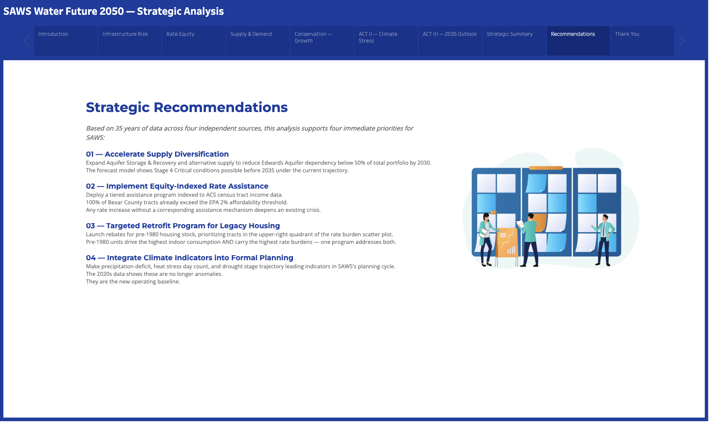
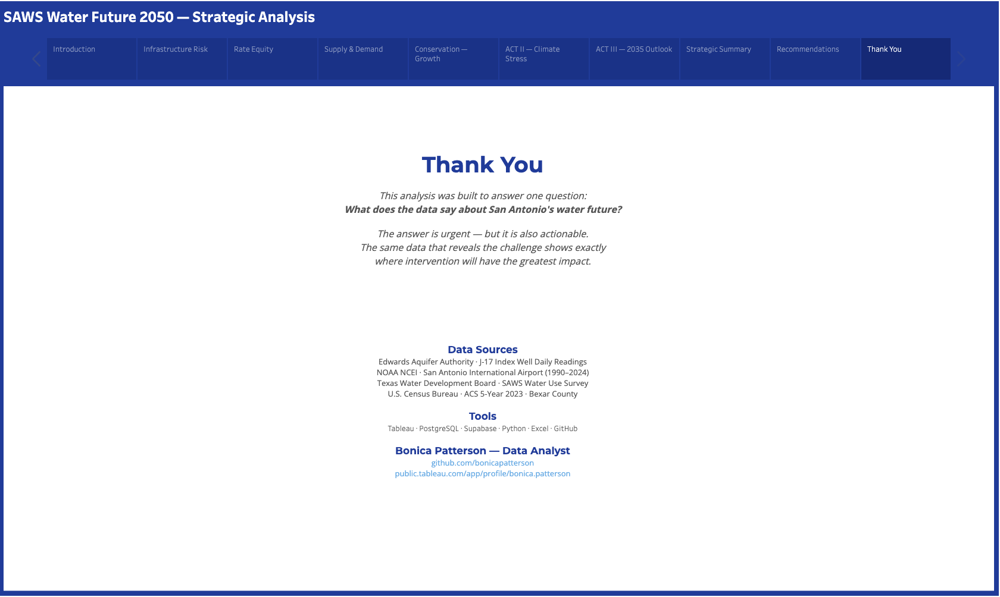

<div align="center">
<a href="https://drive.google.com/file/d/1P_An8l35lfajnl4V3faoZE49f2dyHopD/view?usp=sharing"></img></a>

<br/><br/>

<a href="https://public.tableau.com/app/profile/bonica.patterson/viz/SAWS-Water-Future-2050/SAWSWaterFuture2050StrategicAnalysis?publish=yes">

</a>
&nbsp;
<a href="https://drive.google.com/file/d/1P_An8l35lfajnl4V3faoZE49f2dyHopD/view?usp=sharing">

</a>
&nbsp;
<a href="https://github.com/bonicapatterson">

</a>

<br/><br/>

```
╔══════════════════════════════════════════════════════════════════════╗
║                                                                      ║
║   "Can SAWS sustain safe, equitable, and affordable water service    ║
║    for San Antonio through 2035 and beyond — given accelerating      ║
║    aquifer decline, rapid population growth, and a widening          ║
║    affordability crisis?"                                            ║
║                                                                      ║
╚══════════════════════════════════════════════════════════════════════╝
```

</div>

---

<div align="center">

### 35 Years of Data &nbsp;·&nbsp; 4 Independent Sources &nbsp;·&nbsp; 10-Slide Interactive Story &nbsp;·&nbsp; Forecast to 2035

|  |  |  |  |
|---|---|---|---|

</div>

---

## 📋 Table of Contents

| Section | |
|---|---|
| [🔴 The Crisis in Numbers](#-the-crisis-in-numbers) | Key findings at a glance |
| [🎯 Project Overview](#-project-overview) | What this is and why it was built |
| [📊 Data Sources](#-data-sources) | Four independent public datasets |
| [🗺️ Story Structure](#️-story-structure) | 10-slide narrative walkthrough |
| [🖥️ Dashboard Gallery](#️-dashboard-gallery) | All 10 slides with screenshots |
| [💡 Strategic Recommendations](#-strategic-recommendations) | Four data-grounded priorities |
| [🔬 Methodology](#-methodology--data-pipeline) | Full analytical pipeline |
| [🛠️ Tech Stack](#️-tech-stack) | Tools and architecture |
| [📁 Repository Structure](#-repository-structure) | File organization |
| [▶️ Reproduce This Analysis](#️-how-to-reproduce) | Step-by-step setup |
| [👩🏾‍💻 About](#-about) | Background and other projects |

---

## 🔴 The Crisis in Numbers

<div align="center">

```
╭─────────────────────────────────────────────────────────────────────╮
│                                                                     │
│   🔴  100 of 100 census tracts exceed the EPA affordability limit   │
│   🔴  Aquifer trending toward Stage 4 Critical before 2035          │
│   🟠  421 drought days in the 2020s — decade not over yet           │
│   🟠  33% connection growth in 7 years — outpacing conservation     │
│   🟡  Very Low income tracts carry 4%+ rate burden (2× EPA limit)   │
│   🟡  Precipitation below 35-yr baseline most years since 2010      │
│   🔵  Average burden looks fine at 1.39% — the average is a lie     │
│                                                                     │
╰─────────────────────────────────────────────────────────────────────╯
```

</div>

---

## 🎯 Project Overview

San Antonio is one of the fastest-growing cities in the United States; and its water system is under pressure from every direction at once.

This project is a **complete, end-to-end strategic data analysis** built specifically for SAWS — the San Antonio Water System — to answer one research question and deliver four actionable recommendations grounded entirely in measured public data.

The analysis spans **four independent datasets**, **35 years of historical records**, and a **forecast horizon through 2035**. 
It was designed to the standard of a professional utility planning report — not a student exercise.

<div align="center">

| Dimension | Detail |
|---|---|
| **Research Question** | Can SAWS sustain safe, equitable, and affordable service through 2035? |
| **Answer** | No — not under current conditions. But the outcome is not inevitable. |
| **Aquifer Peak (1992)** | 692 ft above mean sea level |
| **Aquifer 2025 Reading** | 630 ft above mean sea level |
| **Total Decline** | 62 feet over 35 years |
| **Forecast** | Stage 3–4 conditions projected before 2035 |
| **Equity Finding** | 100 of 100 tracts above EPA threshold |
| **Growth Finding** | 153,000+ new SF accounts in 7 years |
| **Story Points** | 10 slides (Title → Data → Summary → Recommendations → Close) |
| **Sheets Built** | 16+ individual Tableau visualizations |

</div>

---

## 📊 Data Sources

All four datasets are publicly available. No proprietary or restricted data was used.

<div align="center">

| Source | Dataset | Coverage | Volume |
|---|---|---|---|
| **Edwards Aquifer Authority** via Water Data for Texas | J-17 Index Well Daily Readings | 1990 – 2026 | 13,246 daily obs. |
| **NOAA National Centers for Environmental Information** | Daily Weather Summaries — Station USW00012921, San Antonio Int'l Airport | 1990 – 2024 | 12,784 daily obs. |
| **Texas Water Development Board (TWDB)** | Water Use Survey — SAWS retail connections & volumes by customer category | 2016 – 2023 | 8 annual surveys |
| **U.S. Census Bureau ACS 5-Year 2023** | Tables S1901 (Income), DP04 (Housing), S1701 (Poverty) — Bexar County tracts | 2023 release | 100 census tracts |

</div>

---

## 🗺️ Story Structure

The Tableau story is a **three-act data narrative** moving from historical evidence → causal analysis → forward-looking scenario planning.

```
┌─────────────────────────────────────────────────────────────────────┐
│  SAWS WATER FUTURE 2050 — Complete Story Structure                  │
├─────────────────────────────────────────────────────────────────────┤
│                                                                     │
│  SLIDE 01 ── Title & Research Question                              │
│                                                                     │
│  ACT I — WHAT IS HAPPENING                                          │
│  SLIDE 02 ── Infrastructure Risk (Edwards Aquifer Decline)          │
│  SLIDE 03 ── Rate Equity (Water Affordability Crisis)               │
│                                                                     │
│  ACT II — WHY IT HAPPENED                                           │
│  SLIDE 04 ── Supply Stress (Drought Impact on Portfolio)            │
│  SLIDE 05 ── Conservation vs. Growth (Demand Trajectory)            │
│  SLIDE 06 ── Climate Is the Driver (Root Cause Analysis)            │
│                                                                     │
│  ACT III — WHAT WILL HAPPEN                                         │
│  SLIDE 07 ── Three Futures to 2035 (Interactive Forecast)           │
│  SLIDE 08 ── Strategic Summary (Research Question Answered)         │
│                                                                     │
│  CLOSING                                                            │
│  SLIDE 09 ── Recommendations (Four Strategic Priorities)            │
│  SLIDE 10 ── Thank You & Data Sources                               │
│                                                                     │
└─────────────────────────────────────────────────────────────────────┘
```

---

## 🖥️ Dashboard Gallery

### Slide 1 — Title & Research Question
<div align="center">
<a href="https://drive.google.com/file/d/1P_An8l35lfajnl4V3faoZE49f2dyHopD/view?usp=sharing">  

</a>

*The research question that drives the entire analysis — 35 years of data assembled to answer one question about San Antonio's water future.*
</div>

---

### Slide 2 — Infrastructure Risk Overview

<div align="center">
<a href="https://drive.google.com/file/d/1P_An8l35lfajnl4V3faoZE49f2dyHopD/view?usp=sharing"></img>
</a>

*From 692 ft in 1992 to 630 ft in 2025 — a 62-foot structural decline over 35 years. 2026 readings show Stage 3 drought conditions. This is not a temporary drought.*
</div>

---

### Slide 3 — Rate Equity Analysis
<div align="center">
<a href="https://drive.google.com/file/d/1P_An8l35lfajnl4V3faoZE49f2dyHopD/view?usp=sharing"></a>

*The average looks safe at 1.39% — but 100 of 100 census tracts exceed the EPA threshold. Very Low income communities carry burdens above 4%, more than double the federal guideline.*
</div>

---

### Slide 4 — Supply Portfolio & Drought Stress
<div align="center">
<a href="https://drive.google.com/file/d/1P_An8l35lfajnl4V3faoZE49f2dyHopD/view?usp=sharing"></img></a>

*Aquifer level and drought severity move in near-perfect inverse correlation. The system delivers more water from a shrinking primary source — precisely when conditions are most severe.*
</div>

---

### Slide 5 — Conservation & Growth Forecast
<div align="center">
<a href="https://drive.google.com/file/d/1P_An8l35lfajnl4V3faoZE49f2dyHopD/view?usp=sharing"></img></a>

*Single-family connections grew 33% in 7 years — adding 153,000+ new accounts. Conservation gains are real, but demand growth is outpacing them. Conservation must scale with growth, not lag behind it.*
</div>

---

### Slide 6 — Climate Is the Driver
<div align="center">
<a href="https://drive.google.com/file/d/1P_An8l35lfajnl4V3faoZE49f2dyHopD/view?usp=sharing"></img></a>

*Climate is the root cause — not just a contributing factor. 421 drought days in the 2020s with years still remaining. Precipitation below the 35-year 835mm baseline in the majority of recent years. Heat stress season visibly expanding post-2010.*
</div>

---

### Slide 7 — Three Futures to 2035 *(Interactive)*

<!-- ============================================================ -->
<!--  SCREENSHOT INSTRUCTION — SLIDE 7 (your most impressive)     -->
<!--  Full-window screenshot of the ACT III forecast dashboard    -->
<!--  CRITICAL: Make sure the interactive rate slider in the      -->
<!--  top right shows "0.00%" and is fully visible                -->
<!--  Must show: full aquifer forecast with confidence band and   -->
<!--  all 3 drought threshold lines labeled, SF growth scenario   -->
<!--  chart bottom left, AND rate burden bar chart bottom right   -->
<!--  Save as: assets/slide_07_forecast.png                      -->
<!-- ============================================================ -->

<div align="center">
<a href="https://drive.google.com/file/d/1P_An8l35lfajnl4V3faoZE49f2dyHopD/view?usp=sharing"></img></a>

*The aquifer forecast projects continued decline toward Stage 4 Critical (610 ft) before 2035. The interactive rate increase slider models equity impact across all five income tiers in real time.*
</div>

#### ↳ Interactive Rate Slider — Feature Highlight

<div align="center">
<a href="https://drive.google.com/file/d/1P_An8l35lfajnl4V3faoZE49f2dyHopD/view?usp=sharing">

*At 5% rate increase: Very Low income households exceed 4.2% burden. Low income tracts cross 3%. Every tier is impacted — but not equally. This visualization makes the trade-off visible before any vote is cast.*
</div>

---

### Slide 8 — Strategic Summary

<div align="center">
<a href="https://drive.google.com/file/d/1P_An8l35lfajnl4V3faoZE49f2dyHopD/view?usp=sharing"></img></a>

*Every data point in the analysis connects to one of four pillars. Together, they answer the research question: No — not under current conditions. But the outcome is not inevitable.*
</div>

---

### Slide 9 — Strategic Recommendations
<div align="center">
<a href="https://drive.google.com/file/d/1P_An8l35lfajnl4V3faoZE49f2dyHopD/view?usp=sharing"></img></a>

*Four priorities grounded directly in the data — not general advice, but specific, actionable interventions tied to exact findings from the analysis.*
</div>

---

### Slide 10 — Thank You & Data Sources
<div align="center">
<a href="https://drive.google.com/file/d/1P_An8l35lfajnl4V3faoZE49f2dyHopD/view?usp=sharing"></img></a>

*Full data source attribution and project links.*
</div>

---

## 💡 Strategic Recommendations

The data does not just identify the problem. It points directly to the solution.

### 🔵 1 — Accelerate Supply Diversification
> Expand Aquifer Storage & Recovery (ASR) capacity and alternative supply development to reduce Edwards Aquifer dependency below **50% of total portfolio by 2030**. The forecast model places Stage 4 Critical conditions within reach before 2035 under current trajectory. This is not a long-term planning item — it is an immediate operational priority.

### 🔴 2 — Implement Equity-Indexed Rate Assistance
> Deploy a tiered assistance program indexed to ACS census tract income data — the same data used in this analysis — to protect Very Low and Low income households from rate burden escalation. **Every single census tract** already exceeds the EPA threshold. Any rate increase without a corresponding assistance mechanism deepens a crisis that is already system-wide.

### 🟠 3 — Targeted Retrofit Program for Legacy Housing
> Launch a rebate and retrofit program for **pre-1980 housing stock**, prioritizing census tracts in the upper-right quadrant of the rate burden scatter plot. Pre-1980 units drive the highest indoor water consumption AND carry the highest rate burdens — one targeted program addresses both simultaneously. The scatter plot identifies exactly which neighborhoods to prioritize first.

### 🟢 4 — Integrate Climate Indicators into Formal Planning
> Make precipitation deficit, monthly heat stress day count, and drought stage trajectory **leading indicators** in SAWS's formal planning cycle — not lagging reports. The 2020s data makes clear these signals are no longer anomalies. They are the new operating baseline and should trigger planning conversations before conditions worsen, not after.

---

## 🔬 Methodology & Data Pipeline

```
RAW DATA COLLECTION
        │
        ├── EAA J-17 Daily Readings (13,246 obs.)     waterdatafortexas.org
        ├── NOAA Daily Weather (12,784 obs.)           ncei.noaa.gov
        ├── TWDB Water Use Survey (8 years)            twdb.texas.gov
        └── Census ACS 5-Year 2023 (100 tracts)       data.census.gov
        │
        ▼
DATA CLEANING & PREPARATION  ──  Python + Excel
        │
        ├── NOAA gap filling: interpolation (1–3 day gaps) / exclusion (4+ days)
        ├── Aquifer anomaly flagging (sensor spikes cross-referenced with EAA records)
        ├── Drought stage derivation from J-17 elevation thresholds
        │     Stage 1 ≤ 640 ft  ·  Stage 3 ≤ 625 ft  ·  Stage 4 ≤ 610 ft
        ├── Heat stress flag: days where TMAX > 38°C (100.4°F)
        ├── Rate burden: estimated annual bill ÷ ACS median HH income per tract
        └── Income tier: ACS median income quintile classification
              Very Low · Low · Middle-Lower · Middle-Upper · High
        │
        ▼
DATABASE  ──  PostgreSQL via Supabase
        │
        ├── aquifer_levels      daily J-17 readings + computed drought stage
        ├── weather_daily       precipitation, TMAX, heat stress flag
        ├── water_use_saws      annual volume + connections by category
        └── census_bexar        tract-level income, poverty, housing, rate burden
        │
        ▼
ANALYTICAL LAYER  ──  SQL Computed Fields
        │
        ├── Annual average aquifer level + mode drought stage per year
        ├── Rolling precipitation vs. 835mm 35-year baseline
        ├── Heat stress days per month per year
        ├── Drought days per decade
        ├── Rate burden 2026 by census tract
        └── Linear trend extension to 2035 (R² > 0.85)
        │
        ▼
VISUALIZATION  ──  Tableau Public
        │
        ├── 16+ individual sheets
        ├── 7 assembled dashboards
        ├── 10-slide Tableau Story
        ├── Parameter-driven growth scenario modeling
        ├── Interactive rate increase slider (0–20% range)
        └── 90% confidence interval forecast band
        │
        ▼
STRATEGIC OUTPUT
        └── Research question answered · 4-pillar analysis · 4 recommendations
```

### Key Calculated Fields

| Field | Logic |
|---|---|
| **Rate Burden 2026** | `(Estimated Annual Bill) ÷ (ACS Median HH Income)` — as % |
| **Income Tier** | ACS median HH income classified into 5 quintile tiers across 100 tracts |
| **Drought Stage** | J-17 elevation vs. EAA thresholds: 640 ft / 625 ft / 610 ft |
| **Mode Drought Stage** | Annual mode of daily drought stages — drives bar chart color encoding |
| **Heat Stress Days** | Count of days per month where TMAX > 38°C (100.4°F) |
| **Decade Drought Days** | Sum of days in drought (Stage ≥ 1) grouped by decade |

### Design Philosophy

Every chart subtitle in this analysis is written as a **finding**, not a description.

| ❌ Generic | ✅ Finding |
|---|---|
| *Edwards Aquifer water levels by year* | *The 2020s have already exceeded every prior complete decade — with years still remaining* |
| *Rate burden by census tract* | *100 of 100 Bexar County census tracts exceed the EPA affordability threshold* |
| *SF connections over time* | *Single-family connections grew 33% in seven years — demand growth is outpacing conservation* |

### Known Limitations

- Rate burden estimates use average SF residential consumption (~105,000 gal/yr from TWDB). Actual bills vary by usage tier.
- J-17 represents one monitoring well. Aquifer conditions vary spatially across the recharge zone.
- The 2035 forecast confidence interval widens significantly — the lower bound is more concerning than the point estimate.
- ACS 2023 data reflects 2019–2023 conditions. Rapid post-2023 growth may have shifted some tract distributions.

---

## 🛠️ Tech Stack

<div align="center">

| Layer | Tool | Purpose |
|---|---|---|
| **Visualization** | Tableau Public | 10-slide interactive story, parameter-driven scenario modeling |
| **Database** | PostgreSQL via Supabase | Relational storage, computed columns, cross-table joins |
| **Data Preparation** | Python (pandas) | Gap filling, normalization, anomaly detection, heat stress calc |
| **Data Preparation** | Microsoft Excel | Initial cleaning, pivot analysis, rate burden formula validation |
| **Version Control** | GitHub | Documentation, methodology, full reproducibility |
| **Data** | EAA · NOAA · TWDB · U.S. Census | Four independent public datasets spanning 35 years |

</div>

---

## 📁 Repository Structure

```
saws-water-future-2050/
│
├── README.md                            ← This file
│
├── assets/
│   ├── banner.png                       ← Header banner
│   ├── slide_01_title.png               ← Title & Research Question
│   ├── slide_02_infrastructure.png      ← Infrastructure Risk
│   ├── slide_03_rate_equity.png         ← Rate Equity Analysis
│   ├── slide_04_supply_stress.png       ← Supply Stress & Drought
│   ├── slide_05_conservation.png        ← Conservation & Growth
│   ├── slide_06_climate.png             ← Climate Is the Driver
│   ├── slide_07_forecast.png            ← Three Futures to 2035
│   ├── slide_07_slider_5pct.png         ← Rate slider at 5% (detail)
│   ├── slide_08_summary.png             ← Strategic Summary
│   ├── slide_09_recommendations.png     ← Recommendations
│   └── slide_10_thankyou.png            ← Thank You & Sources
│
├── data/
│   ├── raw/
│   │   ├── export_aquifer_level.csv     ← J-17 daily readings (EAA)
│   │   ├── export_weather.csv           ← NOAA daily summaries
│   │   ├── export_water_use.csv         ← TWDB SAWS survey 2016–2023
│   │   └── export_census_combined.csv   ← ACS 5-Year 2023 Bexar County
│   │
│   └── processed/
│       ├── aquifer_with_stages.csv      ← Aquifer data + drought stage
│       ├── weather_processed.csv        ← Weather + heat stress flag
│       ├── water_use_clean.csv          ← Normalized TWDB data
│       └── census_rate_burden.csv       ← Census + rate burden field
│
├── sql/
│   ├── 01_create_tables.sql             ← Schema for all 4 tables
│   ├── 02_computed_fields.sql           ← Drought stages, heat stress
│   ├── 03_annual_aggregates.sql         ← Year-level summaries
│   ├── 04_decade_aggregates.sql         ← Decade drought day totals
│   └── 05_forecast_prep.sql             ← Linear trend to 2035
│
├── python/
│   ├── data_cleaning.py                 ← Gap filling, normalization
│   ├── rate_burden_calc.py              ← Rate burden per census tract
│   └── heat_stress_calc.py              ← Monthly heat stress counts
│
└── docs/
    ├── methodology.md                   ← Full methodology & decisions
    └── data_dictionary.md               ← All field definitions & sources
```

---

## ▶️ How to Reproduce

### Prerequisites
- Python 3.10+ with `pandas` and `numpy`
- [Supabase](https://supabase.com) account (free tier)
- [Tableau Public](https://public.tableau.com) (free)

### Step 1 — Clone
```bash
git clone https://github.com/bonicapatterson/saws-water-future-2050.git
cd saws-water-future-2050
```

### Step 2 — Download Raw Data
| Dataset | Source | Notes |
|---|---|---|
| EAA J-17 readings | [waterdatafortexas.org](https://www.waterdatafortexas.org/groundwater/well/J-17) | Daily readings, 1990–present |
| NOAA weather | [ncei.noaa.gov](https://www.ncei.noaa.gov/cdo-web/) | Station USW00012921 |
| TWDB water use | [twdb.texas.gov](https://www.twdb.texas.gov/waterplanning/waterusesurvey/estimates/index.asp) | Filter: SAWS |
| Census ACS 2023 | [data.census.gov](https://data.census.gov) | Tables S1901, DP04, S1701 — Bexar County |

### Step 3 — Prepare Data
```bash
pip install pandas numpy
python python/data_cleaning.py
python python/rate_burden_calc.py
python python/heat_stress_calc.py
```

### Step 4 — Load Database
```sql
-- Run in Supabase SQL Editor in order:
-- sql/01_create_tables.sql
-- sql/02_computed_fields.sql
-- sql/03_annual_aggregates.sql
-- sql/04_decade_aggregates.sql
-- sql/05_forecast_prep.sql

-- Validate:
SELECT COUNT(*), MIN(date), MAX(date) FROM aquifer_levels;
-- Expected: 13,246 rows

SELECT COUNT(DISTINCT geoid), ROUND(AVG(rate_burden_2026)::numeric, 4)
FROM census_bexar;
-- Expected: 100 tracts | avg ~0.0139
```

### Step 5 — Connect Tableau
Connect Tableau Public to your Supabase PostgreSQL instance, or load directly from `/data/processed/` CSV files. The live published story is available at the Tableau Public link above.

---

## 📖 Documentation

| Document | Contents |
|---|---|
| [docs/methodology.md](docs/methodology.md) | Data cleaning decisions, computed field logic, design choices, known limitations |
| [docs/data_dictionary.md](docs/data_dictionary.md) | Every field defined with type, unit, and source reference |

---

## 👩🏾‍💻 About

**Bonica Patterson** — Data Analyst

BS Computer Science &nbsp;·&nbsp; MS Digital Forensics & Cyber Investigation
BI Analytics Certification &nbsp;·&nbsp; Data Analytics Certification
*University of Maryland Global Campus*

<div align="center">

[](https://github.com/bonicapatterson)
[](https://public.tableau.com/app/profile/bonica.patterson)
[](https://drive.google.com/file/d/1P_An8l35lfajnl4V3faoZE49f2dyHopD/view?usp=sharing)

</div>

---

## 🔗 Other Projects

<div align="center">

| Project | Domain | Stack |
|---|---|---|
| [🔐 The Quiet Breach](https://github.com/bonicapatterson/The-Quiet-Breach) | Cybersecurity — Insider Threat Detection via Behavioral Analytics | SQL · Tableau · PostgreSQL · Python |
| [🏥 Hospital Readmission Risk](https://github.com/bonicapatterson/hospital-readmission-risk) | Healthcare — Clinical Risk Scoring on MIMIC-III Dataset | SQL · Tableau · PostgreSQL · Supabase |

</div>

---

<div align="center">

```
Built end-to-end with: Tableau · PostgreSQL · Python · Excel · GitHub
Data: Edwards Aquifer Authority · NOAA · Texas Water Development Board · U.S. Census Bureau
Analysis by: Bonica Patterson — 2026
```

*If this analysis is useful to you, please ⭐ the repository.*

</div>
